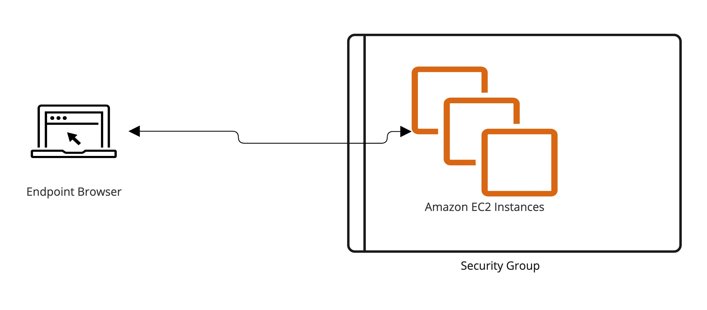
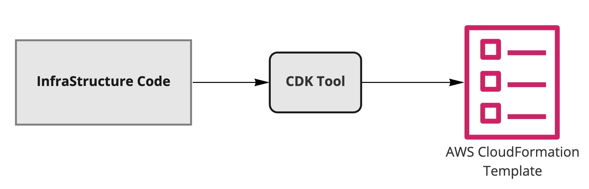
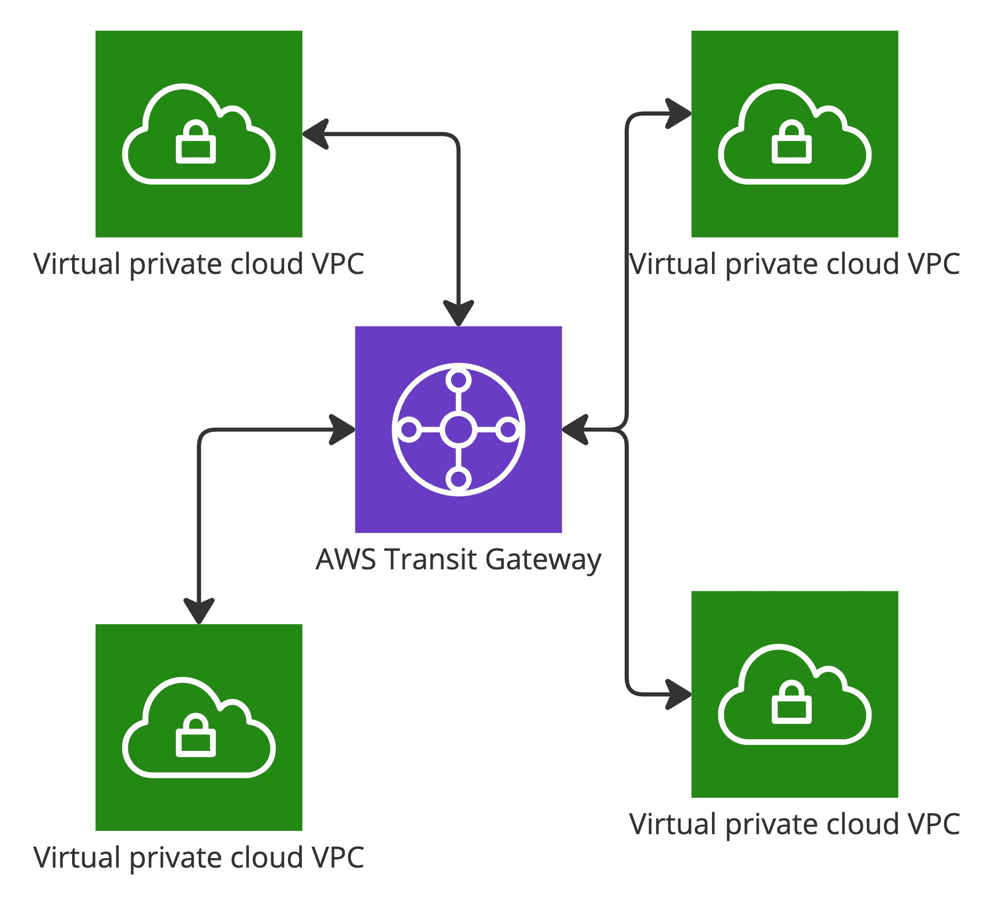

<h4>Notes for Exam</h4>

<h5>Index</h5>
<ol>
  <li>
    <a href="#cloud-computing"><ins>Cloud Computing</ins></a></ins>
  </li>
  <li>
    <a href="#iam---identity-and-access-management"><ins>IAM - Identity and Access management</ins></a>
  </li>
  <li>
    <a href="#ec2---elastic-compute-cloud-iaas"><ins>EC2 - Elastic Compute Cloud</ins></a>
  </li>
  <li>
    <a href="#ec2-instance-storage"><ins>EC2 Instance Storage</ins></a>
  </li>
  <li>
    <a href="#elastic-load-balancing--auto-scaling-groups"><ins>Elastic load Balancing & Auto Scaling groups</ins></a>
  </li>
  <li>
    <a href="#s3---simple-storage-service"><ins>S3 - Simple Storage Service</ins></a>
  </li>
  <li>
    <a href="#databases--analytics"><ins>Database & Analytics</ins></a>
  </li>
  <li>
    <a href="#compute-services---ecs-lambda-batch-lightsail"><ins>Compute Services - ECS, Lambda, Batch, LightSail</ins></a>
  </li>
  <li>
    <a href="#deployments--managing-infrastructure-at-scale"><ins>Deployments & Managing Infrastructure at Scale</ins></a>
  </li>
  <li>
    <a href="#leveraging-the-aws-global-infrastructure"><ins>Leveraging the AWS global Infrastructure</ins></a>
  </li>
  <li>
    <a href="#cloud-integrations"><ins>Cloud Integrations</ins></a>
  </li>
  <li>
    <a href="#cloud-monitoring"><ins>Cloud Monitoring</ins></a>
  </li>
  <li>
    <a href="#vpc--networking"><ins>VPC & Networking</ins></a>
  </li>
  <li>
    <a href="#machine-learning"><ins>Machine Learning</ins></a>
  </li>
  <li>
    <a href="#other-services"><ins>Other Services</ins></a>
  </li>
  <li>
    <a href="#"><ins>AWS Architecting & Ecosystem (T.B.C)</ins></a>
  </li>
  <li>
    <a href="#"><ins>Security & Compliance (T.B.C)</ins></a>
  </li>
  <li>
    <a href="#"><ins>Account Management, Billing & Support (T.B.C)</ins></a>
  </li>
</ol>

---

  <strong>Ways to access the AWS Cloud</strong>
  <ol>
    <li>Management Console (UI).</li>
    <li>AWS SDK - allow your code to access AWS resources.</li>
    <li>AWS CLI - command line iterface tool.</li>
  </ol>

---

<h2>Cloud Computing</h2>

<strong>What is Cloud computing ? </strong>

  It is the on-demand delivery of IT Resources over the internet with pay-as-you-go-pricing. Instead of maintaining physical servers or data centers, you can leverage services such as storage, computing power, network, security and databases from any cloud provider as per the need.

<strong>Deployment Models of Cloud</strong>
<ul>
  <li>Private Cloud e.g. (Rackspace, Digital Ocean, Go Daddy)</li>
  <li>Public Cloud e.g. (AWS, Azure, GCP, Oracle)</li>
  <li>Hybrid Cloud e.g. (AWS + Private Infra)</li>
</ul>

  <strong>Characteristics of Cloud Computing ?</strong>
  <a href="https://www.jigsawacademy.com/blogs/cloud-computing/characteristics-of-cloud-computing/">info</a>

<ul>
  <li><ins>On-demand self service</ins>: Anyone can provision resource and use them without human interaction from the service provider.</li>
  <li><ins>Broad network access</ins>: Can be accessed by diverse client platforms.</li>
  <li><ins>Resource pooling</ins>: Cloud Provider will share all the physical resources (servers, storage, network etc) among multiple clients, Multi-tenant architecture.</li>
  <li><ins>Rapid elasticity and scalability</ins> : Scale based on demand, dispose resources when not needed.</li>
  <li><ins>Measured Service</ins>: Pay for what you use.</li>
</ul> 

  <strong>Six Advantages of cloud computing ? </strong> <a href="https://docs.aws.amazon.com/whitepapers/latest/aws-overview/six-advantages-of-cloud-computing.html">info</a>

<ul>
  <li><ins>Trade Capital Expense (CAPEX) for Variable expense</ins> : Pay on-demand don't own any hardware which reduces the total cost of ownership. No need to maintain a seperate team to handle the infrastructure.</li>
  <li><ins>Benefit from massive economies of scale</ins> : If there are more number of customers which are using the AWS cloud, then lesser the price of using these services.</li>
  <li><ins>Stop guessing capacity</ins> : Scale up/down based on the demand.</li>
  <li><ins>Increase speed and agility</ins> : Add or Remove any new services anytime.</li>
  <li><ins>Stop spending money running and maintaining data centers</ins> : Leverage the power of the cloud.</li>
  <li><ins>Go global in minutes</ins> : Easily deploy application in multiple regions around the world.</li>
</ul>

  <strong>Types of Cloud Computing</strong> <a href="https://docs.aws.amazon.com/whitepapers/latest/aws-overview/types-of-cloud-computing.html" >info</a>

<ul>
  <li><ins>Infrastructure as a Service (IaaS)</ins> : As an end user you need to maintain and configure the servers data storage, capcity, networking, db storage and connectivity, assess and security concerns of the resources.</li>
  <li><ins>Platform as a Service (PaaS)</ins> : As an end user you only need to manage application and its deployment. Underlying hardware, OS and its patches will be taken care by the Provider.</li>
  <li><ins>Software as a Service (SaaS)</ins> : As and end user your focus should be only on using the application. How it is built, is it scalable ? is not our concern.</li>
</ul>

  
  
Cloud computing types responsibilities

  <strong>Pricing of the Cloud </strong> <a href="https://aws.amazon.com/pricing/">info</a>

<ul>
  <li><ins>Compute</ins> : Pay for the compute time.</li>
  <li><ins>Storage</ins> : Pay for the data stored in the cloud.</li>
  <li><ins>Data transfer OUT of the cloud</ins> : Data transfer in is free.</li>
</ul>

---

<h2>IAM - Identity and Access management</h2>
<strong>What is IAM ?</strong>

  AWS Identity and Access Management (IAM) provides fine-grained access control across all of AWS resources. With, IAM you can create users, groups and 
  assign permissions to them.

  
  
IAM Users and Groups

<strong>IAM Identities</strong> <a href="https://docs.aws.amazon.com/IAM/latest/UserGuide/id.html">info</a>

  IAM identity provides access to an AWS account. Each IAM identity can be associated with one or more policies. Different types of identities under IAM:

<ul>
  <li><ins>Users</ins>: Members/Employees of the organization with pre-defined privileges and having an account in the AWS cloud. ROOT user is the one who registered the account, rest are called as the IAM users invited or added by the ROOT.</li>
  <li><ins>Groups</ins>: Consists of only users added to it. A user can be a part of one or more group. Group cannot be added to another group.</li>
  <li><ins>Permissions</ins>: Defines what privileges a user can have, in short which AWS resource an individual or a service can access or work with e.g. S3, EC2, Lambda, EBS etc</li>
  <li><ins>Role</ins>: A Role is a logical entity inside AWS, which can be assigned to any user/service. Roles have policies/permissions assigned to it and should be undertaken by any service/user who needs it.
    

      <ins>Scenarios when you need to create roles</ins>
      <ul>
        <li><ins>Lambda Role</ins> : Lambda needs to access the S3 bucket to store or retrieve some files.</li>
        <li><ins>EC2 Role</ins> : EC2 services needs to access the S3 bucket to store or retrieve some files.</li>
        <li><ins>SQS Role</ins> : SQS services needs to send objects to lambda for further processing.</li>
      </ul>
    

  </li>
</ul>

<strong>Access Management - IAM Policy structure</strong> <a href="https://docs.aws.amazon.com/IAM/latest/UserGuide/access_policies_manage.html">info</a>

  Policies are JSON documents that are associated with a group, role or user. Policies define the types of permissions that a user can have. You should only assign the permissions that are required by the users.

  In the policy Version, ID, and a Statement are included. Because a statement is a list, it must contain at least one statement in order to be considered a valid policy. It manages the permissions required by the user or a service for various AWS resources.

Example policy allowing all resources to access the S3 getObject service in AWS.

<pre style="color:#FFF;background-color:#464646;">
  {
    "Id": "CustomS3ObjectAccessPolicy2072022",
    "Version": "2012-10-17",
    "Statement": [
      {
        "Sid": "StmtForCustomS3ObjectAccessPolicy2072022",
        "Effect": "Allow",
        "Principal": "*",
        "Action": [
          "s3:getObject"
      ],
      "Resource": "arn:aws:s3:::demo-learning-web-bucket/*"
      }
    ]
  }
</pre>

<ul>
  <li><ins>Id</ins>: the identifier of the policy. AWS recommended to use UUID for uniqueness.</li>
  <li><ins>Version</ins>: Specifies which syntax rules to be followed for the policy structure. Latest version is the "2012-10-17" older was "2008-10-17". Policy variables is introduced in the latest version.</li>
  <li><ins>Statement</ins>: contain a single statement or an array of individual statements. </li>
  <li><ins>Sid</ins>: unique identifier for the statement.</li>
  <li><ins>Effect</ins>: possible values Allow/Deny.</li>
  <li><ins>Principal</ins>: Who need to access, ARN of the user or the Service. Can specify a single value or a list.</li>
  <li><ins>Action</ins>: Possible actions that must be allowed to that resource. Inthe above example you are only allowing the getObject action from S3.</li>
  <li><ins>Resource</ins>: Limit to individual resources created under a Service. In the above example you are allowing access to a single bucket "demo-learning-web-bucket" created under the AWS S3 service.</li>
</ul>

<h4>Advanced</h4>
<ol>
  <li>
    <strong>AWS Cloudshell</strong>: This service is available only in few regions. It provides with an in browser terminal to interact with the AWS account and its services, alternative of using AWS-CLI.
  </li>
  <li>
    <strong>IAM Security Tool</strong>
    

      <ol>
        <li><ins>IAM Credential Report</ins> : lists all users in the account and status of their credntials such as access keys, mfa status, password, last login etc</li>
        <li><ins>IAM Access Advisor</ins> : Shows permission granted to the user and when those services were last accessed.</li>
      </ol>
    

  </li>
  <li>
    <strong>S.T.S Security Token Service</strong>: AWS provides AWS Security Token Service (AWS STS) as a web service that enables you to request temporary, limited-privilege credentials for AWS Identity and Access Management (IAM) users or for users you authenticate (federated users).
  </li>
  <li>
    <strong>Cognito</strong>: Amazon Cognito provides authentication, authorization, and user management for your web and mobile apps. Your users can sign in directly with a user name and password, or through a third party such as Facebook, Amazon, Google or Apple.
  </li>
  <li>
    <strong>Directory Service</strong>: AWS Directory Service provides multiple ways to use Microsoft Active Directory (AD) with other AWS services. Directories store information about users, groups, and devices, and administrators use them to manage access to information and resources. AWS Directory Service provides multiple directory choices for customers who want to use existing Microsoft AD or Lightweight Directory Access Protocol (LDAP)–aware applications in the cloud. It also offers those same choices to developers who need a directory to manage users, groups, devices, and access.
  </li>
  <li>
    <strong>AWS Identity Center</strong>: AWS IAM Identity Center (successor to AWS Single Sign-On) helps you securely create or connect your workforce identities and manage their access centrally across AWS accounts and applications. IAM Identity Center is the recommended approach for workforce authentication and authorization on AWS for organizations of any size and type. 
  </li>
</ol>

---

<h2>EC2 - Elastic Compute Cloud (IaaS)</h2>

  Amazon Elastic Compute Cloud (Amazon EC2) provides scalable computing capacity in the Amazon Web Services (AWS) Cloud. It eliminates the need to invest in hardware up front, so you can develop and deploy applications faster. Amazon EC2 enables you to scale up or down; handle changes in requirements or spikes in popularity, reducing the need to forecast traffic.

<strong>Instance Start-up</strong>

EC2 service allows user to select below configuration when starting up a new EC2 instance.

<ul>
  <li>Operting system : Window, Linux, Mac OS</li>
  <li>Compute Power & CPU cores</li>
  <li>System memory or RAM</li>
  <li>Storage Space in G.B.</li>
  <li>Static IP addresses assigned to the machine</li>
  <li>Security groups or the ports to allow and disallow the traffic</li>
  <li>EC2 user data - set up shell script commands to install or update any package when creating a new virtual machine, the script is only executed once. Can be used to setup a lamp stack, git tools, os updates etc</li>
</ul>

<strong>EC2 instance type</strong> <a href="https://aws.amazon.com/ec2/instance-types/">info</a>

<ol>
  <li><ins>General Purpose</ins>: General purpose instances provide a balance of compute, memory and networking resources, good to use as application web servers.</li>
  <li><ins>Compute Optimised</ins>: Applications which require high processing power. e.g. batch processing, machine learning etc</li>
  <li><ins>Memory Optimised</ins>: Applications that process large data sets in memory. e.g. redis cache, non relation database, solr search cache etc This storage is best suitable for temporary storage data which be recreated anytime if there is a loss.</li>
  <li><ins>Accelerated Computing</ins>: Accelerated computing instances use hardware accelerators, or co-processors, to perform functions, such as floating point number calculations, graphics processing, or data pattern matching, more efficiently than is possible in software running on CPUs.</li>
  <li><ins>Storage optimised</ins>: Perform sequential read write operations on large datasets. These instances are fine tuned to deliver multiple low-latency, random I/O operaions per second for any application.</li>
</ol>

<strong>EC2 Security groups</strong> <a href="https://docs.aws.amazon.com/AWSEC2/latest/UserGuide/ec2-security-groups.html">info</a>

  Security group allow incorming and outgoing traffic from your ec2 instances by acting as a firewall. you can configure the ports and the type of traffic that must be allowed to your EC2 instance. Incoming traffic is configred via the inbound rules and Outgoing using the outbound rules. By default all outgoing traffic only is allowed on security groups, you can attach more than one security group to any EC2 instances.

  
  
Security Groups overview

<strong>EC2 - Instance connect</strong>

  Allows to SSH into EC2 instance by starting a terminal session in the browser. Currently only works with linux AMI.

<strong>How do roles work for EC2 instances ?</strong>

  Application running on the EC2 instances needs access to the S3 service. So instead of adding the access_id/secret on the EC2 instance which will be a bad idea (anyone can see it), you create an IAM role and attach it to the instance. The role would be having all the necessary policies attached to it so that it can access the S3 service, application then can use the role's temporary credentials to access the S3 service.

  
  
EC2 role representation

<strong>Instance purchasing options</strong> <a href="https://docs.aws.amazon.com/AWSEC2/latest/UserGuide/ec2-reserved-instances.html">info</a>

  Amazon EC2 provides the following purchasing options which enable cost optimazation as per the need -:

<table>
  <thead>
    <tr>
      <th>Type</th>
      <th>Scope</th>
      <th>Description</th>
    </tr>
  </thead>
  <tbody>
    <tr>
      <td><strong>On-Demand Instances</strong></td>
      <td>Regional/Zonal</td>
      <td>Pay, by the second, for the instances that you launch.</td>
    </tr>
    <tr>
      <td><strong>Savings Plans</strong></td>
      <td>Regional/Zonal</td>
      <td>Reduce your Amazon EC2 costs by making a commitment to a consistent amount of usage, in USD per hour, for a term of 1 or 3 years. Further usage is priced as per on-demand rates.</td>
    </tr>
    <tr>
      <td><strong>Reserved Instances</strong></td>
      <td>Regional/Zonal</td>
      <td>Reduce your Amazon EC2 costs by making a commitment to a consistent instance configuration, including instance type and region, OS for a term of 1 or 3 years.</td>
    </tr>
    <tr>
      <td><strong>Convertible Reserved Instances</strong></td>
      <td>Regional/Zonal</td>
      <td>Allows to change the EC2 instance typem instance family, OS, scope and memory.</td>
    </tr>
    <tr>
      <td><strong>Sceduled Reserved Instances</strong></td>
      <td>Regional/Zonal</td>
      <td>With Scheduled Reserved Instances, you can reserve capacity that is scheduled to recur daily, weekly, or monthly, with a specified start time and duration, for a one-year term. After you complete your purchase, the instances are available to launch during the time windows that you specified.</td>
    </tr>
    <tr>
      <td><strong>Spot Instances</strong></td>
      <td>Regional/Zonal</td>
      <td>Request unused EC2 instances, which can reduce your Amazon EC2 costs significantly.</td>
    </tr>
    <tr>
      <td><strong>Dedicated Hosts</strong></td>
      <td>Specific Region</td>
      <td>Pay for a physical host that is fully dedicated to running your instances, and bring your existing per-socket, per-core, or per-VM software licenses to reduce costs. Most expensive option.</td>
    </tr>
    <tr>
      <td><strong>Dedicated Instances</strong></td>
      <td>Regional/Zonal</td>
      <td>Pay, by the hour, for instances that run on single-tenant hardware.</td>
    </tr>
    <tr>
      <td><strong>Capacity Reservations</strong></td>
      <td>Zonal</td>
      <td>Reserve capacity for your EC2 instances in a specific Availability Zone for any duration.</td>
    </tr>
  </tbody>
</table>

---

<h2>EC2 Instance Storage</h2>

  Amazon EC2 provides with flexible, cost effective, and easy-to-use data storage options for your EC2 instances. Each option has a unique combination of performance and durability.

<ol>
  <li><strong>EBS - Elastic block storage</strong>
  

    Amazon EBS is network storage drive that can be attached to any EC2 instance for storing data which requires frequent updates. EBS drive can be attached to only one EC2 instance, but you can attach multiple EBS to one EC2 instance. These drives are confined to a given avaialbility zone i.e you cannot attach drive in us-east-1a to and EC2 isntance running in us-east-1b. In order to create backups of the attached EBS volumes you create snapshots which can be attached to any EC2 in another region or AZ.
    <a href="https://docs.aws.amazon.com/AWSEC2/latest/UserGuide/AmazonEBS.html">info</a>
  

  

    
    
Elastic block storage representation

  

</li>
<li>
  <strong>EBS - Snapshot</strong>
  

    Backup of EBS volumes is called as Snapshots. Can be taken when the EBS volume is attached to the EC2 instance, good is to dettach before taking the snapshot. It cab be copied across regions and AZ to attach it to another EC2 instances.<a href="https://docs.aws.amazon.com/AWSEC2/latest/UserGuide/EBSSnapshots.html">info</a>
  

  <ins>EBS Features</ins>
  <ul>
    <li>Move the snapshot to archive tier which can reduce the cost upto 75%. Restoring from archive tier can take upto 24-48 hours.</li>
    <li>Deleted snapshots can be recovered by setting up a retention period.</li>
  </ul>
</li>
<li>
  <strong>AMI - Amazon Machine Images</strong>
  

    Are images which are created and maintained by the AWS team which helps in launching an EC2 instance, similar to an operating system image. you can launch multiple instance having the same AMI or different AMIs.
  

  

    you can create our own AMI by launching an EC2 instance and then customizing it as per our own requirement to create an image from it. This created image is specific to a region and can be copied across multiple regions.<a href="https://docs.aws.amazon.com/AWSEC2/latest/UserGuide/AMIs.html">info</a>
  

</li>
<li>
  <strong>EC2 - Builder image</strong>
  

    Automate the create, update, test and distribute cycle of AMI or container images. This service can be run in a schedule daily, weekly, bi-weekly or on monthly basis. You pay only for the resources utilized for creating the image and the storage space required by the created image. Resources required for creating an image includes the EC2 instance as it takes the user supplied (bootstrap) commands to create the final image. Imagine this as creating a docker image in local using a Dockerfile, you need an environment to create it. As it is a regional service you can distribute it across any region.<a href="https://docs.aws.amazon.com/imagebuilder/latest/userguide/what-is-image-builder.html">info</a>
  

  

    
    
Image builder process

  

</li>
<li>
  <strong>EC2 - Instance Store</strong>
  

    An instance store provides temporary block-level storage for our instance. This storage is located on disks that are physically attached to the host computer. Instance store is ideal for temporary storage of information that changes frequently, such as buffers, caches, scratch data, and other temporary content, or for data that is replicated across a fleet of instances, such as a load-balanced pool of web servers.
  

  

    An instance store consists of one or more instance store volumes exposed as block devices. The size of an instance store as well as the number of devices available varies by instance type.<a href="https://docs.aws.amazon.com/AWSEC2/latest/UserGuide/InstanceStorage.html">info</a>
  

</li>
<li>
  <strong>EFS - Elastic File Storage</strong>
  

    Amazon EFS provides scalable file storage for use with Amazon EC2. You can use an EFS file system as a common data source for workloads and applications running on multiple instances. EFS can only be attached to linux machines.<a href="https://docs.aws.amazon.com/efs/latest/ug/whatisefs.html">info</a>
  

</li>
<li>
  <strong>EFS-IA - Elastic File Storage Infrequent access</strong>
  

    Storage class optmized to redice cost of storage for file which are not accessed frequently. Cost are 92% lower than EFS standard class. Set a policy to move files to EFS-IA if they are not accessed in x days.
  

</li>
</ol>

---

<h2>Elastic load Balancing & Auto Scaling groups</h2>

<ol>
  <li>
    <strong>Scalability & High Availability</strong>
    

      A measurement of a system's ability to grow to accommodate an increase in demand. High availability means running your system/application in multiple regions or availability zones to avoid failure or hardware loss. A System or an Infrastructure can be called as scalable in two ways.
    

    <ul>
      <li><ins>Vertical Scalability</ins>: Increasing the size of the instance or resource attached to it viz. RAM, CPU, Storage etc</li>
      <li><ins>Horizontal Scalability</ins>: Increase the number of instances running <a href="https://docs.aws.amazon.com/whitepapers/latest/real-time-communication-on-aws/high-availability-and-scalability-on-aws.html">info</a></li>
    </ul>
  </li>
  <li>
    <strong>Elasticity</strong>
    

      Any system which can scale up or down depending on the load. Elasticity is the ability to acquire resources as you need them and release resources when you no longer need them. In the cloud, you want to do this automatically. 
    

  </li>
  <li>
    <strong>Agility</strong>
    

      Ability to add new resources and hardware at ease.
    

  </li>
  <li>
    <strong>Load Balancers</strong>
    

      A load balancer distributes workloads across multiple compute resources, such as virtual servers. Using a load balancer increases the availability and fault tolerance of your applications.
    

    

      Compute resources can be added or removed from the load balancer as the need change, without disrupting the overall flow of requests to the applications.
    

    

      You can configure health checks, which monitor the health of the compute  resources, so that the load balancer sends requests only to the healthy ones.<a href="https://docs.aws.amazon.com/elasticloadbalancing/latest/userguide/what-is-load-balancing.html">info</a>
    

    

      
      
Load Balancers

    

    <strong>Type of Load Balancers</strong>
    <ul>
      <li><ins>Application Load Balancer</ins>: Application Load Balancer operates at the request level (layer 7), routing traffic to targets (EC2 instances, containers, IP addresses, and Lambda functions) based on the content of the request. Ideal for advanced load balancing of HTTP and HTTPS traffic, Application Load Balancer provides advanced request routing targeted at delivery of modern application architectures, including microservices and container-based applications. It simplifies and improves the security of our application, by ensuring that the latest SSL/TLS ciphers and protocols are used at all times.</li>
      <li><ins>Network load Balancer</ins>: Network Load Balancer operates at the connection level (Layer 4), routing connections to targets (Amazon EC2 instances, microservices, and containers) within Amazon VPC, based on IP protocol data. Ideal for load balancing of both TCP and UDP traffic, Network Load Balancer is capable of handling millions of requests per second while maintaining ultra-low latencies. Network Load Balancer is optimized to handle sudden and volatile traffic patterns while using a single static IP address per Availability Zone. It is integrated with other popular AWS services such as Auto Scaling, Amazon EC2 Container Service (ECS), Amazon CloudFormation, and AWS Certificate Manager (ACM).</li>
      <li><ins>Gateway load Balancer</ins>: Gateway Load Balancer helps us easily deploy, scale, and manage your third-party virtual appliances. It gives you one gateway for distributing traffic across multiple virtual appliances while scaling them up or down, based on demand. This decreases potential points of failure in your network and increases availability.</li>
    </ul>
  </li>
  <li>
    <strong>Attaching Load Balancer for EC2 instances</strong>
    
Steps :

    <ul>
      <li>Launch 2 EC2 instances with a single web page (index.html) which identifies the instance which is serving the current request.</li>
      <li>Create a Elastic Load Balancer of type application, attach a secutiry group to it which allows only HTTP traffic (port 80).</li>
      <li>Make sure similar security group are also attached to the EC2 instances to allow HTTP traffic.</li>
      <li>Create a Target Group which registers the two EC2 servers as targets.</li>
      <li>Assign this Target Group to the ALB.</li>
      <li>Copy the DNS name attached to the ALB, open it in the browser and verify if the correct web pages are served.</li>
    </ul>
  </li>
  <li>
    <strong>Auto Scaling Group</strong>
    

      Traffic received by the application can increase at any time. Auto Scaling group contains a collection of EC2 instances that are treated as a logical grouping for the purposes of automatic scaling and management. The main goal of an Auto Scaling Group is to Scale-out (add more instances) when the load on the application increases and scale-in (remove instances) when it decreases, it also ensures that the minimum number of EC2 instances are always running and to replaces the faulty instances with healthy ones.<a href="https://docs.aws.amazon.com/autoscaling/ec2/userguide/auto-scaling-groups.html">info</a>
    

    

      
      
Auto Scaling Group

    

  </li>
  <li>
    <strong>Scaling Strategies</strong>
    <ol>
      <li><ins>Manual Scaling</ins>: Change the ASG settings manually.</li>
      <li>
        <ins>Dynamic Scaling</ins>: Respond to changing demand.
        <ul>
          <li><ins>Simple/Step Scaling</ins>: With step scaling and simple scaling, you choose scaling metrics and threshold values for the CloudWatch alarms that invoke the scaling process.</li>
          <li><ins>Simple/Step Scaling</ins>: Specify an average value or metric of an application e.g. Scale to keep the CPU utilization at 60%.</li>
          <li><ins>Predictive Scaling</ins>: Use predictive scaling to increase the number of EC2 instances in your Auto Scaling group in advance of daily and weekly patterns in traffic flows.</li>
        </ul>
      </li>
    </ol>
  </li>
</ol>

---

<h2>S3 - Simple Storage Service</h2>

  Amazon Simple Storage Service (Amazon S3) is an object storage service that offers industry-leading scalability, data availability, security, and performance. Called as the main backbone of AWS and is promoted as a "infinitely scaling" storage service. Many websites hosted on AWS use S3 for storage as well as many AWS services. <a href="https://docs.aws.amazon.com/AmazonS3/latest/userguide/Welcome.html">info</a>

<strong>Use Cases</strong>

<ul>
  <li>Backup and Storage</li>
  <li>Disaster Recovery</li>
  <li>Application hosting</li>
  <li>Files</li>
</ul>

<strong>Overview of S3 buckets</strong>

<ul>
  <li>Files stored in S3 are called as objects. Objects have a key associated with them which is the full path needed to retrieve that file from a given bucket. Example: s3://my_bucket/my_file.txt => key is my_file.txt</li>
  <li>Buckets created in S3 must have unique name globally (across all regions).</li>
  <li>Buckets are created at region level.</li>
  <li>Maximum upload size is 5TB</li>
</ul>

<ol>
  <li>
    <strong>S3 Security</strong>: Access Control on S3 buckets and the objects contained in it.
    <ul>
      <li><ins>User Based</ins>: IAM Policies attached to a user confined to only specific S3 features.</li>
      <li><ins>Resource (Bucket Policies)</ins>: Permissions attached to the bucket applies to all the objects in the bucket owned by the bucket owner. If ACL option is disabled all objects contained inside the bucket are owned by the account/bucket owner including those uploaded by other AWS accounts. <a href="https://docs.aws.amazon.com/AmazonS3/latest/userguide/bucket-policies.html">info</a></li>
      <li><ins>Resource (Object ACL)</ins>: Finer grain control on the objects uploaded in S3 bucket.</li>
      <li><ins>Resource (Bucket ACL)</ins>: Finer grain control on the Bucket.</li>
    </ul>
  </li>
  <li>
    <strong>S3 Public Bucket Policy</strong>: To allow public access (able to access files in browser or through any service) to files inside any bucket follow the following points. When creating a new/existing S3 bucket uncheck the option which reads "Block all public access", add a new Bucket policy using the <a href="https://awspolicygen.s3.amazonaws.com/policygen.html">Policy Generator</a> which allows all Principals (services/users) to access S3 objects.
    <pre style="color:#FFF;background-color:#464646;">
      {
        "Id": "Policy1661705525639",
        "Version": "2012-10-17",
        "Statement": [
          {
            "Sid": "Stmt1661705522813",
            "Action": [
              "s3:GetObject"
            ],
            "Effect": "Allow",
            "Resource": "arn:aws:s3:::demo-learning-web-bucket-replica",
            "Principal": "*"
          }
        ]
      }
    </pre>
  </li>
  <li>
    <strong>S3 versioning</strong>: Version S3 objects, it is enabled at bucket level. Over-writing the same object creates a new version. Versioning helps you to recover from accidental deletion or roll back to previous version. <strong>Imp notes</strong>: versioning can be enabled/disabled at any time after a bucket is created or when creating a new. If enabled after bucket creation all objects will have default value as "null". Disabling versioning does not deletes the previous versions.
  </li>
  <li>
    <strong>S3 Access Logs</strong>: Log all requests made to a S3 bucket from any service or account. The data is stored in another S3 bucket, used by data analysis tools to find access/usage patterns.
  </li>
  <li>
    <strong>S3 Replication</strong>: Copy contents of S3 bucket to another S3 bucket. Versioning must be enabled to achieve replication. Copying happens asynchronously, buckets can be in diffetent accounts.
    <ul>
      <li><ins>Cross Region Replication</ins>: Copy data to another bucket in different region.</li>
      <li><ins>Same Region Replication</ins>: Copy data to another bucket in same region.</li>
    </ul>
  </li>
  <li>
    <strong>S3 Storage Classes</strong>: Amazon S3 offers a range of storage classes that you can choose from, based on the data access, resiliency, and cost requirements of your workloads. S3 storage classes are purpose-built to provide the lowest cost storage for different access patterns. S3 storage classes are ideal for virtually any use case, including those with demanding performance needs, data residency requirements, unknown or changing access patterns, or archival storage. <a href="https://aws.amazon.com/s3/storage-classes/">info</a>
    
<em>Note:: Check the official AWS docs (https://aws.amazon.com/s3/storage-classes/) for in depth understanding.</em>

    <table>
      <thead>
        <tr>
          <td><strong>Storage Classes</strong></td>
          <td><strong>Availability</strong></td>
          <td><strong>Features</strong></td>
          <td><strong>Use cases</strong></td>
        </tr>
      </thead>
      <tbody>
        <tr>
          <td>S3 Standard - General purpose</td>
          <td>99.99%</td>
          <td>Used for frequently accessed data. Low latency and high throughput.</td>
          <td>Web applications, dynamic applications, big data analytics</td>
        </tr>
        <tr>
          <td>S3 Standard - Infrequent access</td>
          <td>99.99%</td>
          <td>Used for less frequently accessed data, but requires rapid retrieval when needed.Minimum storage duration is 30 days.</td>
          <td>Long term storage, backups, data store for disaster recovery</td>
        </tr>
        <tr>
          <td>S3 One Zone - Infrequent access</td>
          <td>99.5%</td>
          <td>Used for less frequently accessed data, but requires rapid retrieval when needed. This storage class stores data in a single AZ unlike other who stores data into minimum of 3 AZ. Cost 20% less than S3 Standard - IA.Minimum storage duration is 30 days.</td>
          <td>Storing secondary backups</td>
        </tr>
        <tr>
          <td>S3 Glacier - Instant retrieval</td>
          <td>99.99%</td>
          <td>Archive storage class that delivers lowest cost storage for long lived data that is rarely accessed and requires retrieval in milliseconds. Using this storage class can save cost upto 68% than S3 - IA. Minimum storage duratin for objects should be 90 days.</td>
          <td>News media, user generated content etc</td>
        </tr>
        <tr>
          <td>S3 Glacier - Flexible retrieval</td>
          <td>99.99%</td>
          <td>Archived storage class. Costs 10% less than S3 glacier instance retrieval. Data which is less accessed less than 1/2 times in a year. This class differs from S3 - IA or S3 one zone IA, as archived data is not retrieved rapidly (minutes to hours). Configurable retrieval times, from minutes to hours, with free bulk retrievals. Minimum storage duration is 90 days.</td>
          <td>Disaster recovery, offsite data storage etc</td>
        </tr>
        <tr>
          <td>S3 Glacier - Deep Archive</td>
          <td>99.99%</td>
          <td>Archived storage class.Data retrieval can take around 12 hours. Minimum storage duration is 180 days.</td>
          <td>Disaster recovery, offsite data storage etc</td>
        </tr>
        <tr>
          <td>S3 Intelligent - Tiering</td>
          <td>99.99%</td>
          <td>Automatically move objects/files to other storage classes based on the usage patten. Can save cost by moving files to correct tier.</td>
          <td>any use case can be considered</td>
        </tr>
      </tbody>
    </table>
  </li>
  <li>
    <strong>S3 Object lock & Glacier Vault lock</strong>: Adopt a WORM policy (Write Once Read Many) model. Block an object version deletion for a specified amount of time.
  </li>
  <li>
    <strong>S3 Encryption</strong>: Three types to be considere for all uploaded files. No encryption - nothing is encrypted. Server-Side Encryption - Encrypt file after uploaded to S3, handled by AWS. Client side Encryption - USer encypts the file with some private key before uplaoding.
  </li>
  <li>
    <strong>AWS Snow family</strong>: Offline devices to perform data migrations in and out of AWS. If it takes weeks to transfer data to AWS over the network you should use Snowball devices.
    
Devices:

    <table>
      <thead>
        <tr>
          <td></td>
          <td><strong>AWS Snowcone</strong></td>
          <td><strong>AWS Snowball edge storage optimized</strong></td>
          <td><strong>AWS snowball edge compute optimized</strong></td>
          <td><strong>AWS snowmobile</strong></td>
        </tr>
      </thead>
      <tbody>
        <tr>
          <td>Usable HDD Storage</td>
          <td>8 TB</td>
          <td>80 TB</td>
          <td>42 TB</td>
          <td>100 PB</td>
        </tr>
        <tr>
          <td>Usable SDD Storage</td>
          <td>14 TB</td>
          <td>1 TB</td>
          <td>7.68 TB</td>
          <td>No</td>
        </tr>
        <tr>
          <td>Usable vCPUs</td>
          <td>4 vCPUs</td>
          <td>40 vCPUs</td>
          <td>52 vCPUs</td>
          <td>N/A</td>
        </tr>
        <tr>
          <td>Usable Memory</td>
          <td>4 GB</td>
          <td>80 GB</td>
          <td>208 GB</td>
          <td>N/A</td>
        </tr>
        <tr>
          <td>Storage Clustering</td>
          <td>No</td>
          <td>Yes, 5-10 nodes</td>
          <td>Yes, 5-10 nodes</td>
          <td>N/A</td>
        </tr>
        <tr>
          <td>256-bit Encryption</td>
          <td>Yes</td>
          <td>Yes</td>
          <td>Yes</td>
          <td>Yes</td>
        </tr>
        <tr>
          <td>HIPAA Compliant</td>
          <td>No</td>
          <td>Yes, eligible</td>
          <td>Yes, eligible</td>
          <td>Yes, eligible</td>
        </tr>
        <tr>
          <td>Data Sync</td>
          <td>Pre-installed</td>
          <td>No</td>
          <td>No</td>
          <td>No</td>
        </tr>
      </tbody>
    </table>
  </li>
  <li>
    <strong>AWS Edge locations</strong>: Process or generate data on an edge location's. These locations may have limited/no internet access, no access to compiuting power. Examples: Trasport services, Ships, underground mining etc
  </li>
  <li>
    <strong>AWS Storage Gateway</strong>: AWS Storage Gateway is a set of hybrid  cloud storage services that provide on-premises access to virtually unlimited cloud storage.
  </li>
</ol>

---

<h2>Databases & Analytics</h2>

<ol>
  <li>
    <strong>AWS RDS & Aurora</strong>: RDS stands for Relational Database service, and is a managed Database service provided by the AWS. It allows provisioning database engines such as Mysql, Postgres, MariaDb, Oracle, Aurora etc. Aurora is a proprietary database built by AWS. <strong>Aurora is 5x better than using mysql on RDS and 3x better than using postgres on RDS.</strong>
    
 <ins>Why to use RDS ? you can install any database service in EC2 instances right ?</ins>

    <ul>
      <li>RDS is a managed service.</li>
      <li>AWS maintains & updates OS running the RDS instance.</li>
      <li>Features such as auto backups and restore.</li>
      <li>Read replicas for improved read performance.</li>
      <li>Multi AZ setup for Disaster recovery.</li>
      <li>Scaling capability.</li>
      <li>Storage backed by EBS.</li>
      <li>Dashboards for monitoring health.</li>
    </ul>
    

      
      
RDS architecture

    

  </li>
  <li>
    <strong>RDS Deployments options</strong>: Different ways you can configure RDS instances to serve any request.
    <ul>
      <li>
        <ins>Read Replicas</ins>: Amazon RDS Read Replicas provide enhanced performance and durability for Amazon RDS database (DB) instances. They make it easy to elastically scale out beyond the capacity constraints of a single DB instance for read-heavy database workloads. You can create one or more replicas of a given source DB Instance and serve high-volume application read traffic from multiple copies of your data, thereby increasing aggregate read throughput.
        

          
          
RDS deployment architecture

        

      </li>
      <li>
        <ins>Multi AZ</ins>: In an Amazon RDS Multi-AZ deployment, Amazon RDS automatically creates a primary database (DB) instance and synchronously replicates the data to an instance in a different AZ. When it detects a failure, Amazon RDS automatically fails over to a standby instance without manual intervention.
        <a href="https://docs.aws.amazon.com/AmazonRDS/latest/UserGuide/Concepts.MultiAZSingleStandby.html">info</a>
      </li>
      <li>
        <ins>Multi-Region</ins>: Similar to a Multi-AZ dpeloyment, but provides better application performance region wise as there can be multiple read replicas setup for a given primary database.
      </li>
    </ul>
  </li>
  <li>
    <strong>Elastic Cache</strong>: Is a in-memory database, supported engines are Memcache and Redis. Data stored here is not permanent hence should only be used as a cache service. All Database extensive read tasks must be shifted to an in-memory cache for better performance as it has low latency. 
<em>Strategy :: For any item that needs to be written to DB -> check if it exists in cache -> if not write/update to db then to the cache -> read from cache always -> if deleted from db delete from cache.</em>

  </li>
  <li>
    <strong>Dynamo DB</strong>: It is a fully managed NoSQL database. Data stored in dynamo db is encrypted at rest by default. Low in cost and has auto scaling capabilities. Data is stored in SSD's and replicated across multiple Availability Zones in an AWS Region, providing built-in high availability and data durability.
    
<ins>Dynamo Accelerator DAX</ins>: Cache specific for dynamoc DB. Caches items which are frequently accessed.

    
<ins>Dynamo Global Tables</ins>: Make a DynamoDB table accessible with low latency across multiple regions.

  </li>
  <li>
    <strong>Redshift</strong>: Based on PostgreSQL but not used for OLTP. Used for OLAP - online analytical proceessing. Columnar storage of data instead of Row, 10x better performance than other data warehousing tools. Provides SQL interface to execute queries.
  </li>
  <li>
    <strong>Amazon EMR</strong>: Stands for "Elastic MapReduce". Creates a Hadoop Cluster to analyze and process vast amount of data. Cluster can be made of multiple EC2 instances. EMR takes care of provisioning and configuring the instances. Provides auto-scaling and is integrated with Spot instances.
  </li>
  <li>
    <strong>Athena</strong>: Serverless query service to perform analytics against S3 objects. Use standard SQL language to query the files. Supports CSV, JSON, ORC files. Use-cases look for a pattern in log files.
  </li>
  <li>
    <strong>QuickSight</strong>: Serverless machine learning-powered business intelligence service to create dashboards. Can source data from RDS/Redshift/DynamoDb etc
  </li>
  <li>
    <strong>Document DB</strong>: AWS name for MongoDB with many performance changes added by AWS team.
  </li>
  <li>
    <strong>Neptune</strong>: Amazon Neptune is a fast, reliable, fully managed graph database service that makes it easy to build and run applications that work with highly connected datasets. The core of Neptune is a purpose-built, high-performance graph database engine that is optimized for storing billions of relationships and querying the graph with milliseconds latency. Neptune supports the popular graph query languages Apache TinkerPop Gremlin and W3C’s SPARQL, allowing you to build queries that efficiently navigate highly connected datasets. Neptune powers graph use cases such as recommendation engines, fraud detection, knowledge graphs, drug discovery, and network security.
  </li>
  <li>
    <strong>Amazon OLDB</strong>: Amazon Quantum Ledger Database (Amazon QLDB) is a fully managed ledger database that provides a transparent, immutable, and cryptographically verifiable transaction log owned by a central trusted authority. It is used to track all application data changes, and maintain a complete and verifiable history of changes over time.
  </li>
  <li>
    <strong>Managed Blockchain</strong>: Blockchain makes it possible to build applications where multiple parties can execute transactions without the need for a trusted, central authority.
  </li>
  <li>
    <strong>AWS Glue</strong>: Managed ETL (Extract Transform Load) service. Good to prepare and transform data (script) for analytics.
  </li>
  <li>
    <strong>DMS Service</strong>: Database migration service. Extract source data from XYZ database and restore to AWS managed database.
  </li>
</ol>

---

<h2>Compute Services - ECS, Lambda, Batch, LightSail</h2>

<ol>
  <li>
    <strong>ECS</strong>: Amazon Elastic Container Service (Amazon ECS) is a highly scalable and fast container management service. Use it to run, stop, and manage containers on a cluster. With Amazon ECS, containers are defined in a task definition that you use to run an individual task or tasks within a service. In this context, a service is a configuration that you use to run and maintain a specified number of tasks simultaneously in a cluster.
    
Featuers of ECS

    <ul>
      <li>Integration with IAM.</li>
      <li>Integration with other AWS services.</li>
      <li>Integration with CI/CD tools and processes which monitors source code and build new images, then pushes to the registry.</li>
      <li>Support for sending container instance logs to cloud-watch.</li>
    </ul>
  </li>
  <li>
    <strong>Fargate</strong>: Similar to ECS only difference is the infrastructure is managed by AWS, hence you do not have to plan for capacity, servers, disk space etc. AWS will run the containers with the supplied configuration RAM/CPU.
  </li>
  <li>
    <strong>ECR</strong>: Elastic Container Registry, private registry to store Docker images.
  </li>
  <li>
    <strong>Serverless</strong>: Do not manage any infrastructure, just deploy the code and use the service. It is billed as Pay-per go pricing model.
  </li>
  <li>
    <strong>Lambda</strong>: Lambda is a compute service that lets us run code without provisioning or managing servers. Lambda runs our code on a high-availability compute infrastructure and performs all of the administration of the compute resources, including server and operating system maintenance, capacity provisioning and automatic scaling, and logging. With Lambda, you can run code for virtually any type of application or backend service. <a href="https://docs.aws.amazon.com/lambda/latest/dg/welcome.html">info</a>
    
<ins>Examples/Use-cases</ins>

    <ul>
      <li>Lambda connected to an API gateway which performs authentication tasks.</li>
      <li>Connected with cloud watch event rule "cron job".</li>
      <li>Push/Pull data from Snowflake.</li>
    </ul>
  </li>
  <li>
    <strong>API Gateway</strong>: Amazon API Gateway is an AWS service for creating, publishing, maintaining, monitoring, and securing REST, HTTP, and WebSocket APIs at any scale. API developers can create APIs that access AWS or other web services, as well as data stored in the AWS Cloud.
    
API gateway allows us to create the following API types HTTP, WebSocket, REST , REST API Private (Accesible only from a VPC).

  </li>
  <li>
    <strong>AWS Batch</strong>: Managed service providing batch processing at a larger scale and provides the ability to access large amount of computing power. Can run 1000* of batch jobs efficiently. Batch service provisions EC2/Spot instance dynamically. Batch jobs are designed as Docker images which run on ECS inside the provision EC2 servers.
  </li>
  <li><strong>LightSail</strong>: Provides with virtual servers, database and networking; for users who do not wish to get into details of EC2 instance handling and has less cloud experience. Provides with high availability but provides no auto scaling and has limited integrations with other AWS services. e.g. Hosting a Lamp stack, good for dev/test sites etc
  </li>
</ol>

---

<h2>Deployments & Managing Infrastructure at Scale</h2>

<ol>
  <li>
    <strong>Cloud Formation</strong>: Have all the Infrastructure as Yaml code; (IaC templates) Create a template that describes all the AWS resources that are needed (like Amazon EC2 or Amazon RDS DB instances), and CloudFormation takes care of provisioning and configuring those resources for you. No manual intervention needed to create and configure AWS resources and figure out what's dependent on what; CloudFormation handles all the configuration.
  </li>
  <li>
    <strong>Cloud Development Kit (CDK)</strong>: Instead of writing cloud (IaC) templates in yaml format (cloud formation templates), CDK allows you to write them in any language of choice such as python, typescript, java, .net etc and this service compiles the code into CloudFormation templates.
    

      
      
CDK process

    

  </li>
  <li>
    <strong>Elastic Beanstalk</strong>: Managed service which can be used to deploy/host your application in AWS cloud. Instance and OS configuration is handled by Beanstalk service. Provides with services such as capacity provisioning, load balancing & auto scaling.
    
<a href="https://medium.com/@kyawzinlatt/aws-elastic-beanstalk-or-aws-lightsail-when-to-use-which-f448e4a49147">AWS Beanstalk vs LightSail</a>.

  </li>
  <li>
    <strong>CodeDeploy</strong>: Managed Service which can be used to deploy code automatically to other services such as EC2, Lambda, Fargate and on-premises servers. CodeDeploy can deploy application code that runs on a server which is stored in Amazon S3 buckets, GitHub repositories, or Bitbucket repositories. It scales with the infrastructure, as in it can deploy to single or multiple instances without much delay.
    <ul>
      <li>Rapidly release new features.</li>
      <li>Update AWS Lambda function versions.</li>
      <li>Avoid downtime during application deployment.</li>
    </ul>
  </li>
  <li>
    <strong>CodeCommit</strong>: Source control service that hosts GIT based repositories. Makes it easy to collaborate with other users.
  </li>
  <li>
    <strong>CodeBuild</strong>: Managed Code building service in the cloud. Can pull data from CodeCommit, compile it, run unit tests and create deployable artifacts.
    <ul>
      <li>Fully managed, serverless.</li>
      <li>Continuosly scalable and higly available.</li>
      <li>Only pay for the build time.</li>
    </ul>
  </li>
  <li>
    <strong>Code Pipeline</strong>: CodePipeline is a continuous delivery service that automates the building, testing, and deployment of your software into prod/dev/test environments. Earlier you saw CodeDeploy, CodeCommit and CodeBuild; wondering how all of them can be connected ? CodePipeline allows us to create a view of the famous CI/CD tool using all of the above and other different services.
    

      
      
AWS Codepipeline

    

  </li>
  <li>
    <strong>CodeArtifact</strong>: It is a Artifact Management system which is usually used by a code-pipeline stage to store and retrieve artifacts. 
Example: When running test cases in our code repository, test stage will create a test report file and store the same in the artifactory.

    
Example 2: Integrate the build process with sonar lint and store the reports of all code violations in the artifactory.

  </li>
  <li>
    <strong>CodeStar</strong>: Easier way to quickly setup CodeCommit, CodePipeline, CodeBuild, CodeDeploy, EC2 and other services. This service provides with an UI interface which allows us to use the above mentioned services.
  </li>
  <li>
    <strong>CloudNine</strong>: Is a Cloud IDE for writing, running and debugging our code. It opens in a browser, user can start working on any project with doing any pre-required code or development environment setup. Allows for code collaboration in real time.
  </li>
  <li>
    <strong>Systems Manager</strong>: AWS service to control/monitor/debug/update/patch the overall provisioned application infrastructure or the different AWS services. It helps administrators to investigate issues with any of the service or a group of services and remediate them by rolling out patches/updates.
    
Example: you need to monitor the fleet of EC2 instances, starting you need the SSM Agent installed on all of the  instances so that they can be controlled at once using the Systems manager service. 

    

      
      
Systems Manager

    

  </li>
  <li>
    <strong>SSM Session Manager</strong>: Start a secure shell session to any of the EC2 instances controlled by the sessions manager service.
  </li>
  <li>
    <strong>AWS Ops Works</strong>: AWS OpsWorks is a configuration management service that helps to configure and operate applications in a cloud enterprise by using Puppet or Chef. AWS OpsWorks Stacks and AWS OpsWorks for Chef Automate allow to use Chef cookbooks and solutions for configuration management, while OpsWorks for Puppet Enterprise lets us configure a Puppet Enterprise master server in AWS. Puppet offers a set of tools for enforcing the desired state of your infrastructure, and automating on-demand tasks.
  </li>
</ol>

--- 

<h2>Leveraging the AWS global Infrastructure</h2>

<ol>
  <li>
    <strong>Global Applications</strong>: Application's deployed in multiple AZs and regions, not restricted to a given geographic area. This setup allows you to operate applications which are highly available, fault tolerant and scalable <a href="https://aws.amazon.com/about-aws/global-infrastructure/">info</a>
    
Benefits of using the Global Infrastructure -:

    <ul>
      <li>Security</li>
      <li>Scalability</li>
      <li>Availability</li>
      <li>Flexibility</li>
      <li>Performance - (Decreased Latency)</li>
      <li>Global Footprint</li>
      <li>Disaster Recovery: Failover to another region if there a disaster at some geographic location.</li>
    </ul>
  </li>
  <li>
    <strong>Route 53</strong>: It is a highly scalable and available DNS management service. <strong>DNS</strong> = The Domain Name System is the hierarchical and decentralized naming system used to identify computers reachable through the Internet or other Internet Protocol networks. (name => IP Address mapping) (www.google.com => 142.250.182.228)
    
<strong>DNS Record types </strong><a href="https://docs.aws.amazon.com/Route53/latest/DeveloperGuide/ResourceRecordTypes.html">info</a>

    <ul>
      <li>A record : Domain to IPv4</li>
      <li>AAAA record : Domain to IPv6.</li>
      <li>Alias record : Route traffic from a Domain to some AWS service.</li>
      <li>CNAME record : Route traffic from a Domain to another domain.</li>
    </ul>
    
<strong>Routing Policy </strong><a href="https://docs.aws.amazon.com/Route53/latest/DeveloperGuide/routing-policy.html">info</a>

    <ul>
      <li><ins>Simple routing</ins>: Domain pointing to a single webserver.</li>
      <li><ins>Failover routing</ins>: DNS system does a Health check on the webserver and sends traffic to the health one.</li>
      <li><ins>Geolocation routing</ins>: Redirect client request to the nearest server determined by the users location.</li>
      <li><ins>Geoproximity routing</ins>: Redirect client request to the nearest server determined by the users location as well the resources.</li>
      <li><ins>Latency routing</ins>: Redirect traffic to the server which provides the least latency.</li>
      <li><ins>IP-based routing</ins>: Route traffic based on the location of the users, and have the IP addresses that the traffic originates from</li>
      <li><ins>Multivalue answer routing</ins>: T.B.D</li>
      <li><ins>Weighted routing</ins>: Route traffic to multiple resources in proportions that is specified. Weighted records can be created in private hosted zone.</li>
    </ul>
  </li>
  <li>
    <strong>Cloudfront</strong>: Is a Content Delivery Network (CDN), which speeds up the delivery of static assets of website (.css, .js, .html, img/*). Cloud front serve requested resources through a network of data locations called the Edge locations. There are in total 216 AWS edge locations globally.
    
<ins>How does Cloudfront serve any requests ?</ins>: 

    <ul>
      <li>When a resource served via. the Cloudfront service is requested, the request is routed to the nearest edge location providing the least latency. Cloudfront will cache the resource, to serve it faster for further requests.</li>
      <li>
        If Cloudfront finds a valid cached copy of the requested resource it will serve the same.
      </li>
    </ul>
    
<ins>Cloudfront distributions</ins>: Distribution must be created in order to use Cloudfront service, it is a set of config which tell the service on how to serve the requested resource. Types of config.

    <ul>
      <li>
        <ins>Content origin</ins>: the Amazon S3 bucket, AWS Elemental MediaPackage channel, AWS Elemental MediaStore container, Elastic Load Balancing load balancer, or HTTP server from which CloudFront gets the files to distribute.</li>
      <li>
        <ins>Access</ins>: whether the files to be available to everyone or restrict access to some users.
      </li>
      <li>
        <ins>Security</ins>: should CloudFront ask users to use HTTPS to access the content.
      </li>
      <li>
        <ins>Cache key</ins>: what must be the value of the cache-key. The cache key uniquely identifies each file in the cache for a given distribution.
      </li>
      <li>
        <ins>Origin request settings</ins>: should cloudfront relay the request Headers, Query, Cookies to the origin service.
      </li>
      <li>
        <ins>Geographic restrictions</ins>: should CloudFront prevent users in selected countries from accessing the content.
      </li>
      <li>
        <ins>Logs</logs>: should CloudFront create standard logs or real-time logs that show viewer activity.
      </li>
    </ul>
  </li>
  <li>
    <strong>S3 Transfer Acceleration</strong>: Amazon S3 Transfer Acceleration is a bucket-level feature that enables fast, easy, and secure transfers of files over long distances between the requestor and an S3 bucket. Transfer Acceleration is designed to optimize transfer speeds from across the world into S3 buckets. Transfer Acceleration takes advantage of the globally distributed edge locations in Amazon CloudFront. As the data arrives at an edge location, the data is routed to Amazon S3 over an optimized network path.
    
<strong>Ways to upload files to an S3 bucket</strong>:

    <ul>
      <li>Directly upload to an S3 bucket.</li>
      <li>Use S3 transger acceleration to upload files.</li>
    </ul>
    
Refer to the following tool to see the different os using Transer Acceleration over direct upload <a href="https://s3-accelerate-speedtest.s3-accelerate.amazonaws.com/en/accelerate-speed-comparsion.html">Link</a>

    

      
      
S3 Transfer Acceleration

    

  </li>
  <li>
    <strong>Global Accelerator</strong>: Create accelerators to improve the performance of the application. When a consumer queries any resource/server hosted on AWS inorder to reduce the total response time, by using Global accelerator you can leverage the AWS internal network which optimizes the request route needed to reach the destination. Done by providing 2 static anycast IP addresses that only need to be configured by users once. Behind these IP address you can add or remove AWS origins, opening up uses such as endpoint failover, scaling, or testing without any user-side changes.
    

      
      
S3 Global Accelerator

    

  </li>
  <li>
    <strong>AWS Outpost</strong>: AWS Outposts is a fully managed service that extends AWS infrastructure, services, APIs, and tools to customer premises. By providing local access to AWS managed infrastructure, AWS Outposts enables customers to build and run applications on premises using the same programming interfaces as in AWS Regions, while using local compute and storage resources for lower latency and local data processing needs.
  </li>
  <li>
    <strong>AWS Wavelength</strong>: AWS Wavelength enables developers to create applications with ultra-low latencies for mobile devices and end users. Wavelength brings standard AWS compute and storage services to the edge of telecom carriers' 5G networks. You can extend an Amazon Virtual Private Cloud (VPC) to one or more Wavelength Zones and then use AWS resources such as Amazon Elastic Compute Cloud (Amazon EC2) instances to run applications that require ultra-low latency and a connection to AWS services in the Region. 
  </li>
  <li>
    <strong>AWS Local zones</strong>: AWS Local Zones are a type of AWS infrastructure deployment that place compute, storage, database, and other select services closer to large population, industry, and IT centers, enabling you to deliver applications that require single-digit millisecond latency to end-users.
  </li>
  <li>
    <strong>Global Application architecture</strong>: Ideal architecture styles to achieve a global application.
    <ul>
      <li>Single region, Single AZ</li>
      <li>Single region, Multi AZ</li>
      <li>Multi region, Active/Passive</li>
      <li>Multi region, Active/Active</li>
    </ul>
  </li>
</ol>

--- 

<h2>Cloud Integrations</h2>

<ul>
  <li><strong>SQS</strong>: Amazon Simple Queue Service (SQS) is a managed message queuing service which is used to send, store and retrieve multiple messages of various sizes asynchronously. Terminologies -: Producers create the message.Consumers, processes the messages. Data persist for a max duration of <strong>14 days</strong>.</li>
  <li><strong>SNS</strong>: Amazon Simple Notification Service (AWS SNS) is a managed service that automates the process of sending notifications to the subscribers attached to it.</li>
  <li><strong>Kinesis</strong>: Amazon Kinesis is a managed, scalable service that allows real-time processing of streaming data per second. It can collect data from multiple sources and then pass onto other applications/services to work on it.</li>
  <li><strong>Amazon MQ</strong>: Amazon MQ is a managed message broker service for Apache ActiveMQ and RabbitMQ that makes it easy to set up and operate message brokers on AWS. Amazon MQ reduces your operational responsibilities by managing the provisioning, setup, and maintenance of message brokers for you. Because Amazon MQ connects to your current applications with industry-standard APIs and protocols, you can easily migrate to AWS without having to rewrite code.</li>
</ul>  

---

<h2>Cloud Monitoring</h2>

<ol>
  <li><strong>Cloudwatch Metric</strong>: Provides information on the health and performance of all AWS services.
  Default metrics are provided by a variety of services, including EC2 instances, EBS volumes, Lambda and RDS DB instances. Cloudwatch collects metrics from all AWS services and displays them in an easy-to-use dashboard formatted as a graph.By default, all metrics are refreshed every five minutes.</li>
  <li><strong>Cloudwatch Alarm</strong>: Alarms are triggered after some cloudwatch metric crosses it defined threshold value. The value can be default usage of the service or deduced via some mathematical calculation. Alarms have actions associated with them, which are performed when the alarm is triggered. e.g Send email to user when the CPU utilization of EC2 isntance crosses 80% or Auto scale the instances if there is more load and downgrade when it is less.</li>
  <li><strong>Cloudwatch logs</strong>: With the help of CloudWatch Logs, you can consolidate all of your system, application, and AWS service logs into a single, scalable service.
  They can then be quickly viewed, searched for certain error codes or patterns, filtered according to particular fields or safely archived for later research.
    

      
      
Collecting logs via the agent

    

  </li>
  <li><strong>EventBridge</strong>: Service which provides with real time delivery of events generated by AWS services. Example : EC2 instance stagte chaning from "Pending" to "Started" or from "Running" to "Stopped". With Event bridge you can capture these events and can have have targets or a group of them which will process these events and perform some actions described for it.
    
<strong>Terminologies</strong> -:

    <ul>
      <li><ins>Events</ins>: An event indicates a change in your AWS environment. AWS resources can generate events when their state changes. </li>
      <li><ins>Rules</ins>: A rule matches incoming events and routes them to targets for processing.</li>
      <li><ins>Targets</ins>: A target processes events it receives events in JSON format.</li>
    </ul>
  </li>
  <li>
    <strong>AWS Cloudtrail</strong>: AWS CloudTrail enables operational and risk auditing, governance, and compliance for your AWS account. Events in CloudTrail are actions taken by a user, role, or AWS service. Events include AWS Management Console, AWS Command Line Interface, and AWS SDKs and APIs actions. 
  </li>
  <li>
    <strong>X-Ray</strong>: AWS X-Ray is a service that gathers information about the requests that your application fulfils and offers tools for you to view, filter, and gain insights into that information in order to spot problems and areas for improvement. You may view comprehensive details for any tracked request made to your application, including the request, the answer, and any calls that your application makes to databases, web APIs, microservices, and downstream AWS resources. 
  </li>
  <li>
    <strong>Codeguru</strong>: Amazon CodeGuru is a developer tool that provides intelligent recommendations to improve code quality and identify an application’s most expensive lines of code. Static code analysis, similar to what Sonar Qube/Profiler tool does. Has integrations with Github, BitBucket, CodeCommit etc
  </li>
  <li>
    <strong>Service Health</strong>: Shows health of all AWS service for all regions. <a hred="https://health.aws.amazon.com/health/status">AWS Health Dashboard</a>
  </li>
  <li>
    <strong>Personal Health Dashboard</strong>: Personalized view of all the service which you are using. example :: if you have EC2 instances deployed which also send/fetch data from the SQS quque service, then personal health dashboard will only give insights on those two services which are deployed.
  </li>
</ol>

---

<h2>VPC & Networking</h2>

<ol>
  <li>
    <strong>VPC - Virtual Private Cloud</strong>: A VPC is a virtual network that closely resembles a traditional network that you'd operate in your own data center. As the name suggest it is a private cloud where you deploy the AWS resources related to your application stack. <a href="https://docs.aws.amazon.com/vpc/latest/userguide/what-is-amazon-vpc.html">info</a>
    

      
      
VPC Diagram

    

  </li>
  <li>
    <strong>Subnet</strong>: A subnet is a range of IP addresses in your VPC. A subnet must reside in a single Availability Zone. After you add subnets, you can deploy AWS resources in your VPC. <a href="https://docs.aws.amazon.com/vpc/latest/userguide/what-is-amazon-vpc.html">info</a>
  </li>
  <li>
    <strong>Public Subnet</strong>: Subnet which is accessible from the Internet.
  </li>
  <li>
    <strong>Private Subnet</strong>: Subnet which is not accessible from the Internet.
  </li>
  <li>
    <strong>IGW - Internet Gateway</strong>: Help the VPC resources to connect with Internet.
  </li>
  <li>
    <strong>NAT Gateway</strong>: Allow your private subnet to connect to internet while reamining private.
  </li>
  <li>
    <strong>Security Group and NACL (Network Access Control List)</strong>:
    <table>
      <thead>
        <tr>
          <td><strong>Security Group</strong></td>
          <td><strong>NACL</strong></td>
        </tr>
      </thead>
      <tbody>
        <tr>
          <td>Attached to EC2 instances</td>
          <td>Attached at Subnet level</td>
        </tr>
        <tr>
          <td>Provides with Allow rules</td>
          <td>Provides with both Allow and Deny rules</td>
        </tr>
        <tr>
          <td>Security groups are stateful i.e. any change to incoming rule (traffic) is also applicable to outgoing rule. e.g. If we allow incoming traffic on PORT 80 outgoing traffic is also allowed.</td>
          <td>NACL are stateless i.e. any change to incoming rule (traffic) is not applicable to outgoing rule. e.g. If we allow incoming traffic on PORT 80 outgoing traffic must be explicitly allowed.</td>
        </tr>
        <tr>
          <td>Multiple Security groups can be attached to a single EC2 instance</td>
          <td>One NACL attached to a Subnet</td>
        </tr>
      </tbody>
    </table>
  </li>
  <li>
    <strong>VPC Flow logs</strong>: You can record details about the IP traffic to and from network interfaces in your VPC using a feature called VPC Flow Logs.Data from flow logs can be published to Amazon CloudWatch Logs, Amazon S3, or Amazon Kinesis Data Firehose, among other places.Following the creation of a flow log, the entries can be retrieved from the log group, bucket, or delivery stream that you configured and viewed. 
  </li>
  <li>
    <strong>VPC Peering</strong>: Connecting two VPC is called as VPC peering. Peering is not transitive i.e. if VPC(A) <-> VPC(B) & VPC(A) <-> VPC(C) then VPC(B) not connected to VPC (C). VPC Peering allows us to create a bigger network of resources across multiple regions.
    

      
      
VPC Peering

    

  </li>
  <li>
    <strong>VPC Endpoint</strong>: VPC Endpoints allows you to connect to AWS services over a private network (VPN), which provides with lowered latency and and better security to access the AWS cloud.
    <ul>
      <li>
        <ins>VPC Endpoint Gateway</ins>: When connecting to S3 and DynamoDB.
      </li>
      <li>
        <ins>VPC Endpoint Interface</ins>: When connecting to other services.
      </li>
    </ul>
  </li>
  <li>
    <strong>AWS PrivateLink</strong>: Without exposing your traffic to the open internet, AWS PrivateLink offers private connectivity between your on-premises networks, AWS services, and VPCs. Your network design can be greatly simplified by using AWS PrivateLink to connect services across several accounts and VPCs.
    

      
      
VPC Private link

    

  </li>
  <li>
    <strong>Site to Site VPN</strong>: Connect an on premises VPN to AWS. The connection is encrypted and transfer happens over the public internet.
    

      
      
Site to Site VPN

    

  </li>
  <li>
    <strong>Direct Connect (DX)</strong>: Eshtablish a physical connection between on-premises infrastructure and AWS.
  </li>
  <li>
    <strong>Client VPN</strong>: AWS Client VPN is a managed client-based VPN service that gives you access to your on-premises network's and AWS resources safely. With Client VPN, you can use an OpenVPN-based VPN client to access your resources from any place. 
  </li>
  <li>
    <strong>Transit Gateway</strong>: Your on-premises networks and Amazon Virtual Private Clouds (VPCs) are linked together by a central hub using AWS Transit Gateway.By doing this, you can eliminate complicated peering arrangements and simplify your network. Every new connection is formed only once; it functions as a cloud router.
    

      
      
Transit Gateway

    

  </li>
</ol>

---

<h2>Machine Learning</h2>

<ol>
  <li>
    <strong>Rekognition</strong>: Makes it easy to perform image and video analysis with the help of the Amazon Rekognition API. The service can identify objects, people, text, scenes, and activities. Perform accurate facial analysis, face comparison, and face search capabilities. <a href="https://aws.amazon.com/rekognition/">info</a>
  </li>
  <li>
    <strong>Transcribe</strong>: Convert Speech to Text. Support automatic language identification for multi-lingual support, remove PII data using redaction.
  </li>
  <li>
    <strong>Polly</strong>: Turn Text to Speech using deep learning.
  </li>
  <li>
    <strong>Translate</strong>: Natural and accurate language translation.
  </li>
  <li>
    <strong>Lex & connect</strong>: <strong>@todo</strong>
  </li>
  <li>
    <strong>Comprehend</strong>:  Amazon Comprehend is a natural-language processing (NLP) service that uses machine learning to uncover valuable insights and connections in text. usecases : find the language of the text, extract key phrases, peoples, brands or places etc.
  </li>
  <li>
    <strong>Sagemaker</strong>: Amazon SageMaker is a fully managed machine learning service. With SageMaker, data scientists and developers can quickly and easily build and train machine learning models, and then directly deploy them into a production-ready hosted environment.
  </li>
  <li>
    <strong>Forecast</strong>: Forecast is a fully managed service that uses statistical and machine learning algorithms to deliver highly accurate time-series forecasts.
  </li>
  <li>
    <strong>Kendra</strong>: Amazon Kendra is a highly accurate and intelligent search service that enables your users to search unstructured and structured data using natural language processing and advanced search algorithms. Document search service powered by machine learning allows to extract text from documents of multiple formats (text, pdf, HTML, PowerPoint, MS word, FAQs).
  </li>
  <li>
    <strong>Personalize</strong>: Amazon Personalize is a fully managed machine learning service that uses your data to generate item recommendations for your users. It can also generate user segments based on the users' affinity for certain items or item metadata.
  </li>
  <li>
    <strong>Textract</strong>: Amazon Textract makes it easy to add document text detection and analysis to your applications.
  </li>
</ol>

---

<h2>Other Services</h2>

<ol>
  <li>
    <strong>Workspaces</strong>:  Amazon WorkSpaces is a fully managed desktop virtualization service for Windows and Linux that allows you to access resources from any supported device.  <a href="https://aws.amazon.com/workspaces/main/">info</a>
  </li>
  <li>
    <strong>AppStream 2.0</strong>: Amazon AppStream 2.0 is a fully managed, secure application streaming service which allows streaming desktop applications. User can stream any application they want to work on device of their choice.<a href="https://docs.aws.amazon.com/appstream2/index.html">info</a>
  </li>
  <li>
    <strong>Amazon sumerian</strong>: Used to create 3D models, VR (virtual reality) or AR (augmented reality) applications.<a href="https://docs.aws.amazon.com/appstream2/index.html">info</a>
  </li>
  <li>
    <strong>Sumerian</strong>: Used to create 3D models, VR (virtual reality) or AR (augmented reality) applications.<a href="https://aws.amazon.com/sumerian/">info</a>
  </li>
  <li>
    <strong>IoT Core</strong>: Connect billions of IoT devices and route trillions of messages to AWS services without managing infrastructure. <a href="https://aws.amazon.com/iot-core/">info</a>
  </li>
  <li>
    <strong>Elastic Transcoder</strong>: Media Transcoding service, convert your source video file into multiple formats. Source video is an S3 Bucket -> Transcoder -> S3 Bucket. <a href="https://aws.amazon.com/elastictranscoder/">info</a>
  </li>
  <li>
    <strong>AppSync</strong>: AppSync creates serverless GraphQL and Pub/Sub APIs to make application development easier by providing a single endpoint for securely querying, updating, and publishing data. <a href="https://aws.amazon.com/appsync/">info</a>
  </li>
  <li>
    <strong>Amplify</strong>: Amplify is a complete solution that lets frontend web and mobile developers easily build, ship, and host full-stack applications on AWS, with the flexibility to leverage the breadth of AWS services as use cases evolve. No cloud expertise needed.  <a href="https://aws.amazon.com/amplify/">info</a>
  </li>
  <li>
    <strong>Device Farm</strong>: Testing service that lets you improve the quality of your web and mobile apps by testing them across an extensive range of desktop browsers and real mobile devices. <a href="https://aws.amazon.com/device-farm/">info</a>
  </li>
  <li>
    <strong>AWS Backup</strong>: Manage and automate backups across all AWS services. Take on-demand backups, supports Point-in-Time recovery, cross region backups, cross account backups etc <a href="https://aws.amazon.com/backup/">info</a>
  </li>
  <li>
    <strong>Disaster Recovery</strong>: Types of Strategies
    <ul>
      <li><ins>Backup and Restore</ins>: Backup data from Storage S3/EBS in case of failure.</li>
      <li><ins>Pilot Light</ins>: Have few (core) services in the cloud, to failover in case of disaster.</li>
      <li><ins>Warm standby</ins>: Have a minimum but full version of the application in the cloud.</li>
      <li><ins>Multi-Site/Hot Site</ins>: Have full version of the application in the cloud to switch in case of failover.</li>
    </ul>
  </li>
  <li>
    <strong>Elastic Disaster Recovery</strong>:  AWS Elastic Disaster Recovery (AWS DRS) minimizes downtime and data loss with fast, reliable recovery of on-premises and cloud-based applications using affordable storage, minimal compute, and point-in-time recovery. <a href="https://aws.amazon.com/disaster-recovery/">info</a>
  </li>
  <li>
    <strong>DataSync</strong>: AWS DataSync moves large amounts of data online between on-premises storage and Amazon S3, Amazon Elastic File System (Amazon Elastic File System) or Amazon FSx. Manual tasks related to data transfers can slow down migrations and burden IT operations. <a href="https://aws.amazon.com/datasync/">info</a>
  </li>
  <li>
    <strong>Fault Injection Simulator</strong>: AWS Fault Injection Simulator (FIS) is a fully managed service for running fault injection experiments to improve an application’s performance, observability, and resiliency. FIS simplifies the process of setting up and running controlled fault injection experiments across a range of AWS services, so teams can build confidence in their application behavior.<a href="https://aws.amazon.com/fis/">info</a>
  </li>
  <li>
    <strong>Step Functions</strong>: AWS Step Functions is a visual workflow service that helps developers use AWS services to build distributed applications, automate processes, orchestrate microservices, and create data and machine learning (ML) pipelines.
  </li>
  <li>
    <strong>Ground Station</strong>: Control sattelite data, control communications, process data nd scale the sattelite operations.
  </li>
  <li>
    <strong>Pinpoint</strong>: Amazon Pinpoint offers marketers and developers one customizable tool to deliver customer communications across channels, segments, and campaigns at scale. <a href="https://aws.amazon.com/pinpoint/">info</a>
  </li>
  <li>
    <strong>Application Migration Service</strong>: T.B.C
  </li>
</ol>